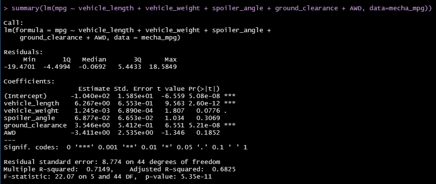
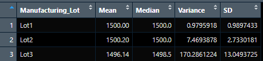
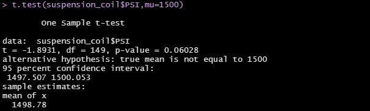
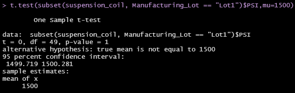
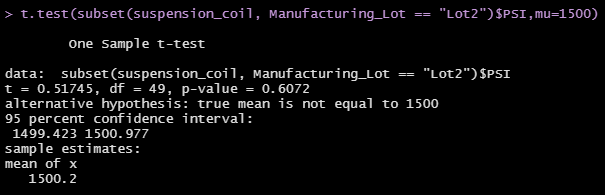
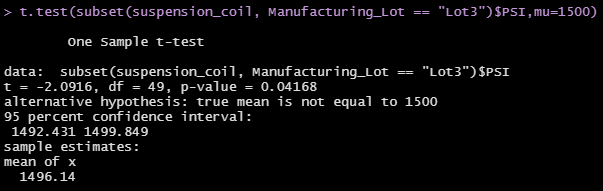

# MechaCar Statistical Analysis
AutosRUs’ newest prototype, the MechaCar, is suffering from production troubles that are blocking the manufacturing team’s progress. AutosRUs’ upper management has tasked us to review the production data for insights that may help the manufacturing team.

## LinearRegression to Predict MPG

Using R, we have design a linear model that predicts the mpg of the 50 MechaCar prototypes using multiple design specifications to identify ideal vehicle performance from the MechaCar_mpg.csv file. These multiple metrics, such as vehicle length, vehicle weight, spoiler angle, drivetrain, and ground clearance, were collected for each vehicle.

Linear Regression Model:

#### Questions:

* *Which variables/coefficients provided a non-random amount of variance to the mpg values in the dataset?*

  Based on the results from the linear regression model, the variables/coefficients that provide a non-random amount of  variance are Vehicle Weight, Spoiler Angle, and AWD bsaed on their Pr(>|t|) value being greater than the significant level of 0.05. What this means is that these three variables would directly affect the MPG values of the prototypes. On the otherhand, Vehicle Length and Ground Clearance have random amounts of variance and would not necessarily directly affect MPG values of the prototypes.
  
* *Is the slope of the linear model considered to be zero? Why or why not?*

  The slope is not zero because the calculated p-value of 5.35e-11 is lower than our 0.05 significant level. This therefore tells us that our slope is not zero. 

* *Does this linear model predict mpg of MechaCar prototypes effectively? Why or why not?*

  Based on the results from the analysis, our multiple R-squared value of 0.7149 suggest that our linear model can predict the MPGs of the MechaCar prototypes effectively.

## Summary Statistic for Coil Suspension

In this analysis, the weight capacities of multiple suspension coils were tested to determine if the manufacturing process is consistent across production lots. We have collected summary statistics on the pounds per square inch (PSI) of the suspension coils from the manufacturing lots in the hopes of determining whether our manufacturing process is consistent.

To determine if the process is consistent, an analysis was performed on the MechaCar Suspension_Coil.csv dataset and the following total summary table was created:

This table indicates that as a whole our production of suspension coils are consistant.

The next table details the individual lots as a lot summary.

This lot summary gives further detail on a individual lot basis. One thing to note is the variances of each of the lots. The variences appear to grow with each new lot. This could mean that our production consistency is slipping with every new lot.

#### Questions:

* *The design specifications for the MechaCar suspension coils dictate that the variance of the suspension coils must not exceed 100 pounds per square inch. Does the current manufacturing data meet this design specification for all manufacturing lots in total and each lot individually? Why or why not?*

  From looking at both tables, we can say that the current manufacturing process mostly meets the design specificaiton. The reason why is if the data is taken as a whole (as in the first table) the varience falls below the max value of 100 PSI which means that the process is good. However, if taken in a per lot basis, we can see that Lot 3 exceeds the maximum value of 100 PSI significantly more times as indicated by the varience value of 170. This can be attributed to multiple factors in the manufacturing process.

## T-Test on Suspension Coils

Here we perform t-tests to determine if all manufacturing lots and each lot individually are statistically different from the population mean of 1,500 pounds per square inch.

#### Summary

We wrote an RScript to determine if the PSI across all manufacturing lots is statistically different from the population mean of 1,500 pounds per square inch. Here's our result:

The p-value calculated for all lots is 0.06028 which is greater than the established 0.05 significant level. We can conclude that the distribution of the data is in a normal distribution.

Then, we performed this same analysis for each of the 3 Lots. Here's our results:

The p-values are as follows:
Lot 1 = 1, Lot 2 = 0.6072, Lot 3 = 0.04168

Interpreting these values, we can conclude that since the p-values of lots 1 & 2 calculated is greater than the established 0.05 significant level, the distribution of the data is in a normal distribution. However, since the p-value of lot 3 is less than the established 0.05 significant level, the distribution of the data is not in a normal distribution.

## Study Design: MechaCar VS. The Competition

In the following, we designed a statistical study to compare the performance of the MechaCar vehicle against the performance of vehicles from other manufacturers.

#### Metric to be tested

Considering the current state of the global economy, we have decided to analyze the cost and fuel efficiency of the MechaCar to its competitors. We believe these metrics to be most important and harbor the greatest interests/influence to potential customers.

#### Null or Alternative Hypothesis

Null Hypothesis - There is no difference in pricing or fuel efficiency for MechaCar to the competition.

Alternative Hypothesis - There is a difference in pricing and fuel efficiency for MechaCar to the competition.

#### Statistical Test

The one-sample T-Test would be employed to both the MechaCar and the competition in order to determine the means for pricing and fuel efficiency. From there a linear regression can be performed with pricing and fuel efficiency as the main factors to focus on.

#### Data for Statistical Test

We will need the pricing and fuel efficency data of both MechaCar and the competition. The data from the competition can be obtained from publicized sales and performance data, however, data will only be available from current on sale competitors vehicles. 
